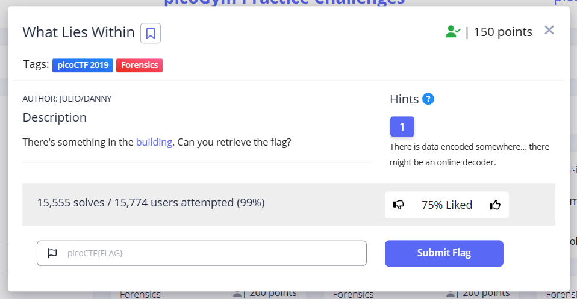
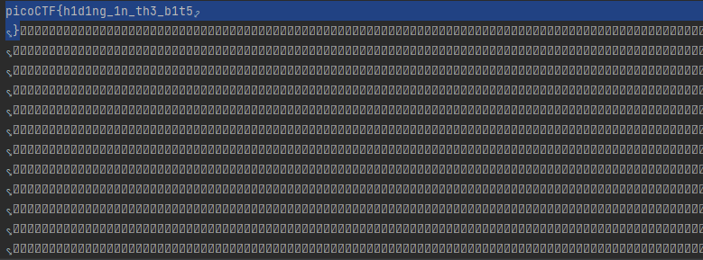

# What Lies Within

This is the write-up for the "What Lies Within" challenge in PicoCTF.

## The Challenge


## Hints
- There is data encoded somewhere... there might be an online decoder.

## Initial Look
An image buildings.png is provided, which shows a picture of a building:


# How to solve it

I wrote a python code to find hidden fata within a picture

```python
from PIL import Image

def detect_hidden_data(image_path, encoding="ascii"):
    # Load the image
    image = Image.open(image_path)

    # Check the image mode and convert to RGB if needed
    if image.mode != "RGB":
        image = image.convert("RGB")

    # Extract the LSBs of each pixel
    pixels = image.load()
    hidden_data = ""
    for y in range(image.height):
        for x in range(image.width):
            r, g, b = pixels[x, y]
            # Extract the LSBs from the RGB values
            hidden_data += bin(r)[-1] + bin(g)[-1] + bin(b)[-1]

    # Convert the binary string to the specified encoding
    hidden_message = ""
    for i in range(0, len(hidden_data), 8):
        hidden_message += chr(int(hidden_data[i:i+8], 2))

    # Decode the hidden message using the specified encoding
    hidden_message = hidden_message.encode(encoding).decode(encoding, errors="ignore")

    return hidden_message

# Specify the path to the image you want to analyze
image_path = "buildings.png"

# Specify the encoding scheme used for the hidden message
encoding = "utf-8"  # Update this with the correct encoding if known

# Call the function to detect hidden data
hidden_message = detect_hidden_data(image_path, encoding)

# Print the detected hidden message
print(hidden_message)


```
I found the hidden flag, also some unknown symbols, but at least we found the flag:




The flag is : `picoCTF{h1d1ng_1n_th3_b1t5}`
