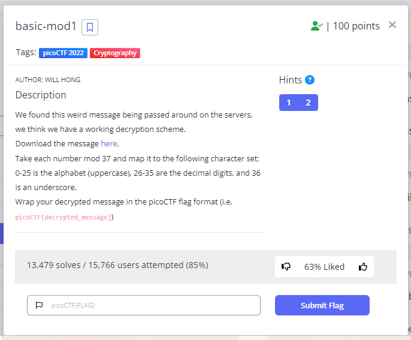
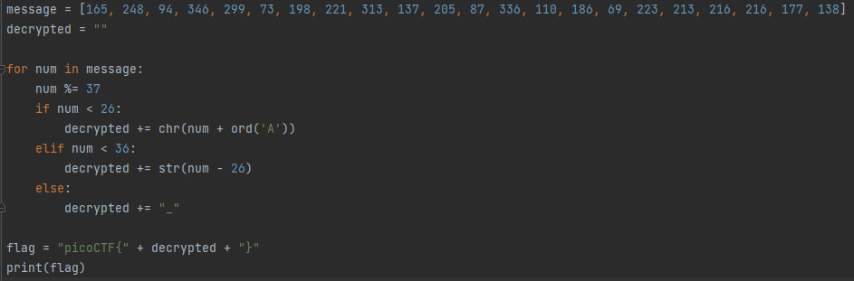
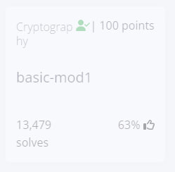

<h1 style="font-size: 48px;">"basic-mod1" Challenge README</h1>
<h2 style="font-size: 20px;">Challenge Description</h2>
The "Mod 37" challenge is a cryptography challenge that requires the user to decrypt a message using a given decryption scheme.
The challenge provides a message encoded as a sequence of numbers, and instructions on how to map each number to a character set.
The user needs to implement the decryption algorithm and use it to recover the original message.

 
<h2 style="font-size: 20px;">Hint</h2>
1. Do you know what mod 37 means? 
2. mod 37 means modulo 37. It gives the remainder of a number after being divided by 37.
<h2 style="font-size: 20px;">Challenge Goals</h2>
The main goal of this challenge is to demonstrate the importance of understanding basic cryptographic principles and to highlight the risks of relying on weak encryption schemes. 
The challenge aims to educate users about the importance of using strong encryption algorithms and key management practices to protect sensitive information.
<h2 style="font-size: 20px;">Challenge Instructions</h2>
Open the challenge website in a web browser.
Read the challenge description and the provided message.
Implement the decryption algorithm using the instructions provided.
Decrypt the message and wrap it in the picoCTF flag format (i.e., picoCTF{decrypted_message}).
Submit the flag to the challenge website to complete the challenge.
<h2 style="font-size: 20px;">Challenge Solution</h2>
The message provided in the challenge is encoded using a simple modulo arithmetic scheme. 
Each number in the message needs to be divided by 37, and the resulting remainder needs to be mapped to a character set as described in the challenge instructions. 
The decryption algorithm can be easily implemented in any programming language, <b>here's my solution in Python:</b> 
 

After running the code I got that the decrypted message is "R0UND_N_R0UND_B6B25531". Therefore i got the flag! :smile:

<h3 style="font-size: 15px;">The flag: picoCTF{R0UND_N_R0UND_B6B25531}</h3>
And that's it, I'm done! :tada::trophy:  
 
<h2 style="font-size: 20px;">Conclusion</h2>
In real-world scenarios, using weak encryption schemes can compromise the security of sensitive information. 
It is essential to understand basic cryptographic principles and use strong encryption algorithms and key management practices to protect sensitive information. 
The "Mod 37" challenge is a valuable learning tool for users to understand the risks and limitations of weak encryption schemes and to encourage the use of strong encryption practices.
